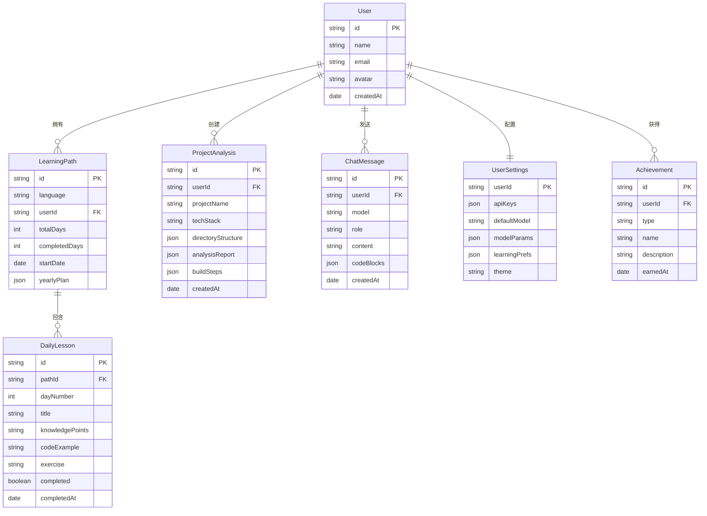

## 1. 架构设计

```mermaid
flowchart TD
    "前端 React 应用" --> "Monaco Editor 核心"
    "前端 React 应用" --> "Zustand 状态管理"
    "前端 React 应用" --> "AI 服务层"
    "AI 服务层" --> "OpenAI API"
    "AI 服务层" --> "Claude API"
    "AI 服务层" --> "通义千问 API"
    "AI 服务层" --> "文心一言 API"
    "AI 服务层" --> "DeepSeek API"
    "前端 React 应用" --> "本地存储 IndexedDB"
    "前端 React 应用" --> "文件系统 API"
    "文件系统 API" --> "项目目录读取"
    "Zustand 状态管理" --> "学习进度 Store"
    "Zustand 状态管理" --> "AI 对话 Store"
    "Zustand 状态管理" --> "用户设置 Store"
```

## 2. 技术说明

- **前端框架**：React@18 + TypeScript + Vite
- **样式方案**：Tailwind CSS@3 + CSS Variables 主题系统
- **代码编辑器**：@monaco-editor/react（VS Code 内核）
- **状态管理**：Zustand（轻量级，适合多 Store 拆分）
- **路由**：react-router-dom@6
- **Markdown 渲染**：react-markdown + remark-gfm
- **图表渲染**：mermaid（架构图/流程图）
- **图标**：lucide-react
- **动画**：framer-motion
- **本地存储**：IndexedDB（Dexie.js 封装）存储学习进度、对话历史
- **后端**：无后端，纯前端应用，API Key 存储在本地，AI 请求直接从前端发出
- **初始化工具**：vite-init

## 3. 路由定义

| 路由 | 用途 |
|------|------|
| `/` | 仪表盘 - 今日任务、学习进度、快捷入口 |
| `/project` | 项目分析 - 导入项目、全景分析、逐步教学 |
| `/learn` | 学习路径 - 语言选择、年度计划、每日课程 |
| `/learn/:language` | 特定语言的学习路径详情 |
| `/learn/:language/day/:dayId` | 某一天的课程内容 |
| `/chat` | AI 对话 - 多模型切换、代码问答 |
| `/settings` | 设置 - API Key、模型配置、学习偏好 |

## 4. 数据模型

### 4.1 数据模型定义



### 4.2 数据定义

使用 IndexedDB (Dexie.js) 存储所有本地数据：

```typescript
// Dexie 数据库定义
class CodeMentorDB extends Dexie {
  learningPaths!: Table<LearningPath>
  dailyLessons!: Table<DailyLesson>
  projectAnalyses!: Table<ProjectAnalysis>
  chatMessages!: Table<ChatMessage>
  userSettings!: Table<UserSettings>
  achievements!: Table<Achievement>

  constructor() {
    super('CodeMentorDB')
    this.version(1).stores({
      learningPaths: 'id, userId, language',
      dailyLessons: 'id, pathId, dayNumber',
      projectAnalyses: 'id, userId',
      chatMessages: 'id, userId, model, createdAt',
      userSettings: 'userId',
      achievements: 'id, userId, type'
    })
  }
}
```

## 5. AI 服务层设计

### 5.1 统一模型接口

```typescript
interface AIModelProvider {
  name: string
  id: string
  icon: string
  sendMessage(messages: ChatMessage[]): AsyncGenerator<string>
  analyzeProject(files: ProjectFile[]): Promise<ProjectAnalysis>
  generateLearningPath(language: string, level: string): Promise<YearlyPlan>
  generateDailyLesson(path: LearningPath, dayNumber: number): Promise<DailyLesson>
  reviewCode(code: string, expected: string): Promise<CodeReview>
}
```

### 5.2 支持的模型

| 模型 | 提供商 | API 端点 | 用途 |
|------|--------|----------|------|
| GPT-4o | OpenAI | api.openai.com | 通用对话、代码分析 |
| GPT-4o-mini | OpenAI | api.openai.com | 轻量对话 |
| Claude 3.5 Sonnet | Anthropic | api.anthropic.com | 深度代码分析 |
| 通义千问 | 阿里云 | dashscope.aliyuncs.com | 中文优化对话 |
| 文心一言 | 百度 | aip.baidubce.com | 中文优化对话 |
| DeepSeek | DeepSeek | api.deepseek.com | 代码专项 |
| GLM-4 | 智谱AI | open.bigmodel.cn | 国产通用 |

### 5.3 流式响应处理

所有 AI 对话采用 SSE (Server-Sent Events) 流式响应，前端逐字渲染，提供实时反馈体验。

## 6. 项目结构

```
src/
├── components/
│   ├── layout/          # 布局组件（侧边栏、顶栏、主内容区）
│   ├── editor/          # Monaco Editor 封装组件
│   ├── chat/            # AI 对话相关组件
│   ├── learning/        # 学习路径相关组件
│   ├── project/         # 项目分析相关组件
│   ├── dashboard/       # 仪表盘相关组件
│   └── common/          # 通用组件（按钮、卡片、徽章等）
├── pages/
│   ├── Dashboard.tsx
│   ├── ProjectAnalysis.tsx
│   ├── LearningPath.tsx
│   ├── LanguageLearn.tsx
│   ├── DailyLesson.tsx
│   ├── AIChat.tsx
│   └── Settings.tsx
├── stores/
│   ├── useUserStore.ts
│   ├── useLearningStore.ts
│   ├── useChatStore.ts
│   ├── useProjectStore.ts
│   └── useSettingsStore.ts
├── services/
│   ├── ai/
│   │   ├── base.ts          # AIProvider 基类
│   │   ├── openai.ts        # OpenAI 适配器
│   │   ├── claude.ts        # Claude 适配器
│   │   ├── qwen.ts          # 通义千问适配器
│   │   ├── wenxin.ts        # 文心一言适配器
│   │   ├── deepseek.ts      # DeepSeek 适配器
│   │   └── index.ts         # 统一导出
│   ├── projectAnalyzer.ts   # 项目分析服务
│   └── learningPlanner.ts   # 学习计划生成服务
├── db/
│   └── index.ts             # Dexie 数据库定义
├── hooks/
│   ├── useAI.ts             # AI 对话 Hook
│   ├── useProject.ts        # 项目操作 Hook
│   └── useLearning.ts       # 学习进度 Hook
├── utils/
│   ├── fileReader.ts        # 文件读取工具
│   ├── codeParser.ts        # 代码解析工具
│   └── promptBuilder.ts     # Prompt 构建工具
├── data/
│   └── languages.ts         # 语言学习模板数据
├── App.tsx
└── main.tsx
```
